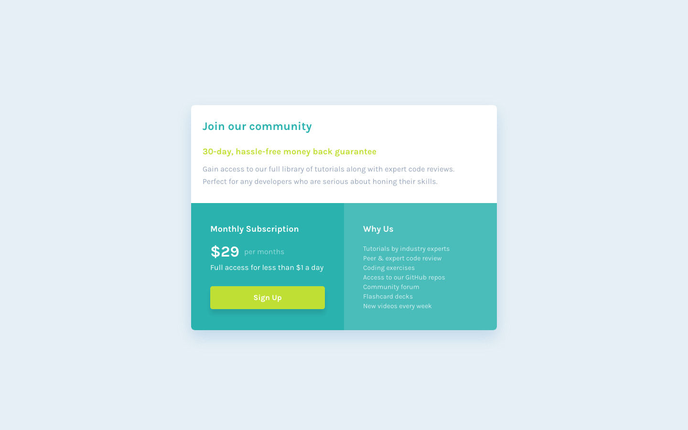
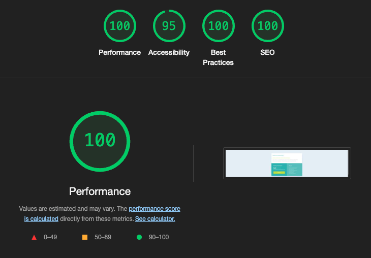
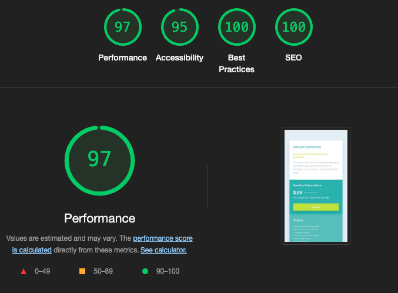

# Frontend Mentor - Single price grid component solution

This is a solution to the [Single price grid component challenge on Frontend Mentor](https://www.frontendmentor.io/challenges/single-price-grid-component-5ce41129d0ff452fec5abbbc). Frontend Mentor challenges help you improve your coding skills by building realistic projects.

## Table of contents

- [Overview](#overview)
  - [The challenge](#the-challenge)
  - [Screenshot](#screenshot)
  - [Links](#links)
- [My process](#my-process)
  - [Built with](#built-with)
  - [What I learned](#what-i-learned)
  - [Continued development](#continued-development)
- [Author](#author)
- [Acknowledgments](#acknowledgments)

## Overview

### The challenge

Users should be able to:

- View the optimal layout for the component depending on their device's screen size
- See a hover state on desktop for the Sign Up call-to-action

### Screenshot

### Links

- [Solution - Github Repository](https://github.com/SeanRavenhill/frontend-mentor-single-price-grid-component)
- [Live Site - Deployed on Vercel](https://frontend-mentor-single-price-grid-component-pied.vercel.app/)

## My process

### Built with

- [React](https://reactjs.org/) - JS library
- [Next.js](https://nextjs.org/) - React framework
- [Tailwindcss v4](https://tailwindcss.com/) - Tailwind CSS framework
- Semantic HTML5 markup
- Flexbox & Grid
- JSON Mock Database
- Mobile-first workflow

### What I learned

- #### Timeboxing & Responsive Design

  - I challenged myself to complete this component in an eight-hour sprint. I started by building the entire pricing grid as one large JSX block in page.tsx. After verifying the mobile layout, I added Tailwind’s sm: breakpoint to transition smoothly into the desktop design.

- #### Component Decomposition

  - I refactored that monolithic block into three focused subcomponents—GridHeader, PricingCard, and FeaturesCard—using a folder-per-component structure with a barrel index.tsx. This reinforced why React and Next.js excel at breaking UIs into smaller, reusable pieces.

- #### Data-Driven UI

  - Instead of hardcoded strings, I introduced a data.json mock database and passed its contents into components via props. It was valuable practice for wiring up real API data in future projects.

- #### Accessibility & ARIA Semantics
  - I deepened my understanding of semantic HTML and ARIA. In particular, I learned to use aria-labelledby on a section or region—pointing it at an h2’s id—rather than overusing aria-label. This exercise helped me appreciate the nuances of accessible markup and why clear landmarks matter.

### Continued development

- #### Speed & Efficiency

  - Challenge myself to reduce development time by planning and executing more deliberately. Over time, I want to eliminate the initial monolithic build entirely and go straight into composing smaller, focused components.

- #### “Thinking in React” from Day One

  - Embrace the [Thinking in React](https://react.dev/learn/thinking-in-react) approach: break down designs into a clear component hierarchy before writing any JSX or Tailwind classes.

- #### Component-First Mindset

  - Start each new feature by sketching its reusable pieces.

- #### Data-Driven Practice

  - Continue wiring components to real or mock data sources (JSON, APIs, CMS) so every UI truly reflects dynamic content rather than hard-coded values.

- #### Iterate on Accessibility
  - Build on my ARIA and semantic-HTML knowledge, researching and eventually integrating automated a11y checks (e.g., eslint-plugin-jsx-a11y or axe-core) into my workflow.

By reinforcing these habits—planning component structure first, coding with data in mind, and eventually automating accessibility checks—I’ll move faster and ship even more robust, maintainable React/Next.js apps.

## Author

- [Sean Ravenhill](https://github.com/SeanRavenhill)
- Frontend Mentor - [@SeanRavenhill](https://www.frontendmentor.io/profile/SeanRavenhill)

## Acknowledgments

- [Frontend Mentor](https://www.frontendmentor.io/) for the challenge design and assets.

- [Codecademy](https://www.frontendmentor.io/https://www.codecademy.com/) for the Front End Career Path curriculum, which helped reinforce core web fundamentals.
